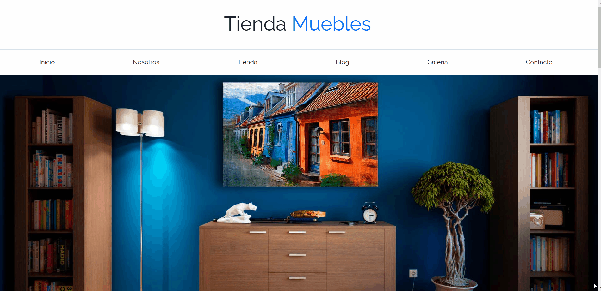

#Web-Eccomerce-Static

Una tienda en línea simple diseñada con HTML y Bootstrap. Este proyecto es una demostración de una plataforma de e-commerce básica, 
diferentes categorias, carrito de compras.

#Galería

Galería de imágenes usando HTML, CSS y Bootstrap, con JavaScript para manejar la apertura y cierre de un modal que muestra las imágenes en tamaño completo.

## Tecnologías Utilizadas

- **HTML5**
- **CSS3**
- **Bootstrap 5**
- **JavaScript**
